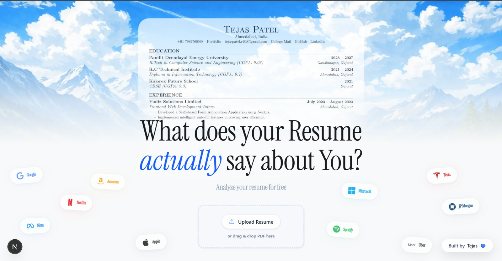
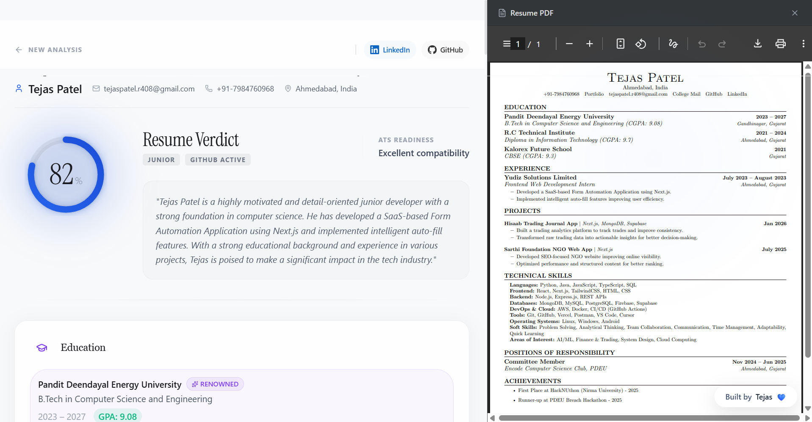
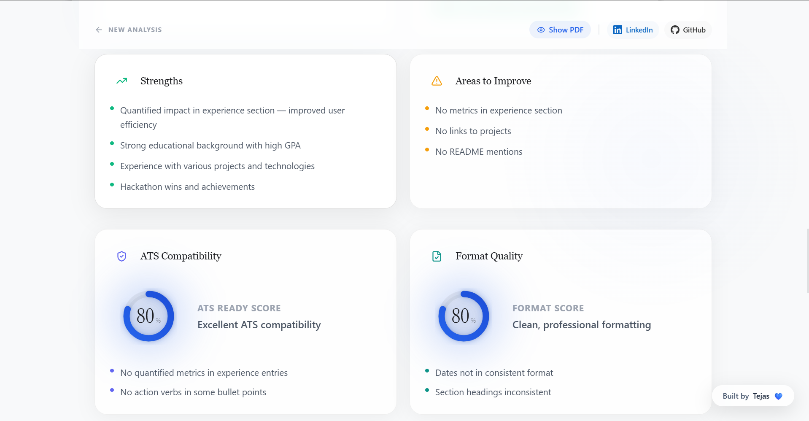
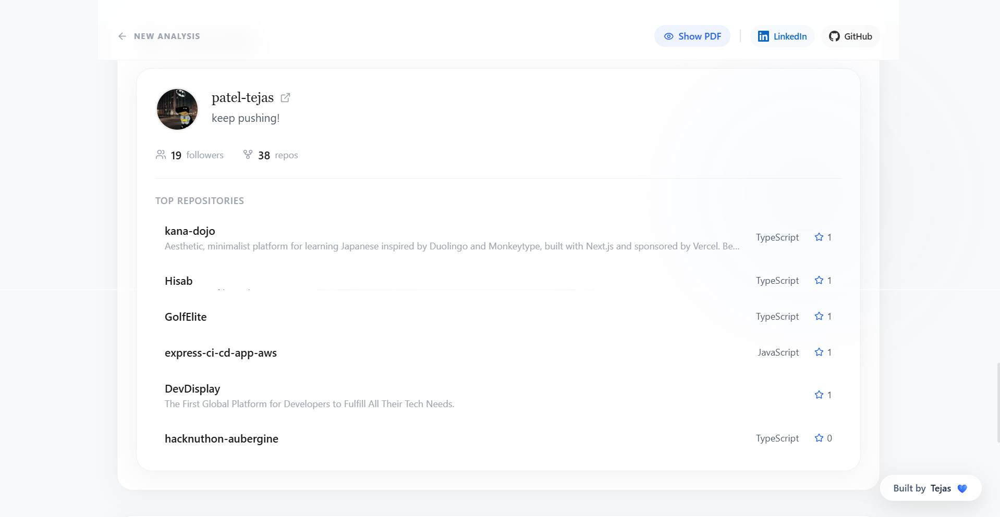
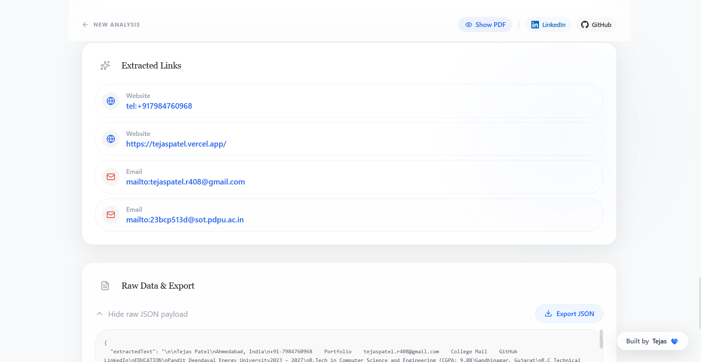
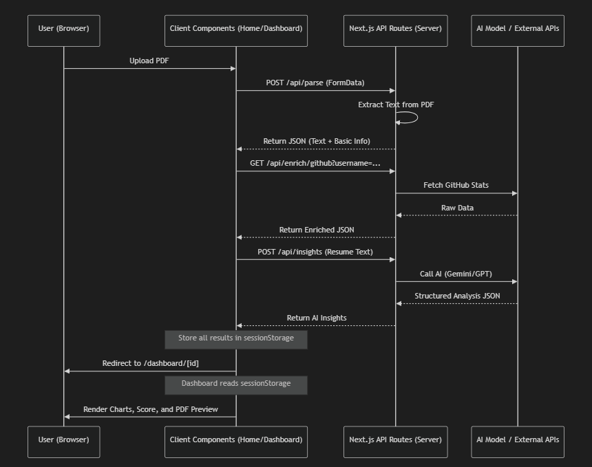

# Blink Resume Parser

This project has been made as my final interview round assignment at Blink Analytics. A modern Next.js application that forensically parses PDF resumes, extracts actionable data, enriches profiles via the GitHub API, and generates strictly formatted AI-powered insights using the Groq LLaMA model—presented in a stunning dark-themed, glassmorphic dashboard.

---

## 📷 Visual Showcase

### Landing Page


### Core Hero Features





### Technical Architecture & Flow


---

## 🚀 Features at a Glance

1. **Intelligent PDF Parsing & Security Validation** 
2. **Dynamic AI Analysis & Scoring**
3. **Automated Social Enrichment (GitHub/LinkedIn)**
4. **Resilient Session Management**
5. **Premium Glassmorphic UI with Micro-Animations**
6. **Unified Progress Reporting**

---

## 🛠️ Step-by-Step System Flow & Architecture

### Step 1: File Upload & Frontend Validation
- **Dropzone UI**: The user interacts with an animated `FileUpload` component.
- **Client-Side Checks**: Ensures the file is a PDF and under the 5MB limit before any network requests are sent.
- **Visual Feedback**: A seamless swap replaces the upload box with a fluid Progress Stepper (`AnimatePresence mode="wait"`), preventing any layout layout shifts over the hero image.

### Step 2: Backend PDF Extraction & Forensic Security
The file is sent to `POST /api/parse`, where it passes through critical validation layers:
- **Magic-Byte Verification**: Checks if the file contains the `%PDF-` header signature. Spoofed extensions are instantly rejected.
- **Text Extraction**: Runs `pdf-parse` to convert the binary stream into raw text.
- **Anti-OCR/Scanned Document Detection**: Verifies that the extracted text exceeds 200 characters. If it is an image-based "fake PDF", it is rejected with instructions to upload a valid text-based file.
- **Resume Content Heuristics**: Scans the text for common resume structural keywords (`experience`, `education`, `skills`, `projects`, etc.). If these signals are missing, the document is flagged and rejected to prevent prompt-injection or garbage data.

### Step 3: Classification & Social Linking
- **Regex Engines**: The parsed text is scanned for GitHub (`github.com/username`) and LinkedIn URLs using custom regex layers.
- **Domain Weighting (`classifyResume.ts`)**: 
  - Analyzes the string frequency of technical, business, and general terminology.
  - Applies a hard-override if platform URLs like LeetCode or GitHub are found.
  - Categorizes the resume natively into `technical`, `business`, or `general` to route to the appropriate AI persona.

### Step 4: Parallel Enrichment & AI Insights
The system uses `Promise.allSettled` to execute parallel tasks on `POST /api/insights`, ensuring the primary flow survives even if third-party APIs fail:
- **GitHub Enrichment (`/api/enrich/github`)**: Fetches profile metadata, follower counts, and heavily-starred repositories via `@octokit/rest`.
- **Groq LLaMA Analysis**:
  - Dynamically injects the resume text into a categorized prompt.
  - Employs strict JSON formatting constraints enforced at the prompt level.
  - Analyzes the resume for ATS compatibility (with score), Formatting Quality, Skill mapping, Strengths, Red Flags, and generates a personalized Executive Summary.
  - Automatically strips markdown fences and gracefully parses JSON output.

### Step 5: Dashboard Visualization
- **Data Persistence**: The completed JSON packet is stringified into the browser's `sessionStorage`. 
  - *Fallback Handling*: A custom `QuotaExceededError` watcher manages base64 inflation; if memory caps are hit, it prompts a graceful refresh rather than crashing.
- **Routing**: The user is pushed to `dashboard/[id]`.
- **Display**: Staggered Framer Motion animations reveal:
  - **ScoreBadges**: Circular SVG gauges animating metrics (ATS/Format).
  - **Skills Radar**: A `recharts` radar map translating raw text to grouped skill archetypes.
  - **Insights & GitHub Cards**: High-end frosted glass layouts displaying qualitative analysis.

---

## 💻 Tech Stack

- **Framework:** Next.js 14+ (App Router)
- **Styling:** Tailwind CSS, custom UI variables (Glassmorphism)
- **Animation:** Framer Motion
- **Parsing:** `pdf-parse`
- **Charts:** Recharts
- **APIs:** Groq (LLaMA), GitHub API (`@octokit/rest`)
- **Icons:** `lucide-react`

---

## ⚙️ Quick Start

### 1. Requirements
- Node.js (v18 or higher)
- Groq API Key
- GitHub Personal Access Token (Optional but recommended)

### 2. Environment Variables
Create a `.env.local` file in the root based on `.env.example`:
```env
GROQ_API_KEY="your_groq_api_key"
GITHUB_TOKEN="your_github_personal_access_token"
```

### 3. Installation & Boot
```bash
# Install dependencies
npm install

# Run development server
npm run dev
```

Navigate to `http://localhost:3000` to interact with the landing page.

---

*Created with love by Tejas*
